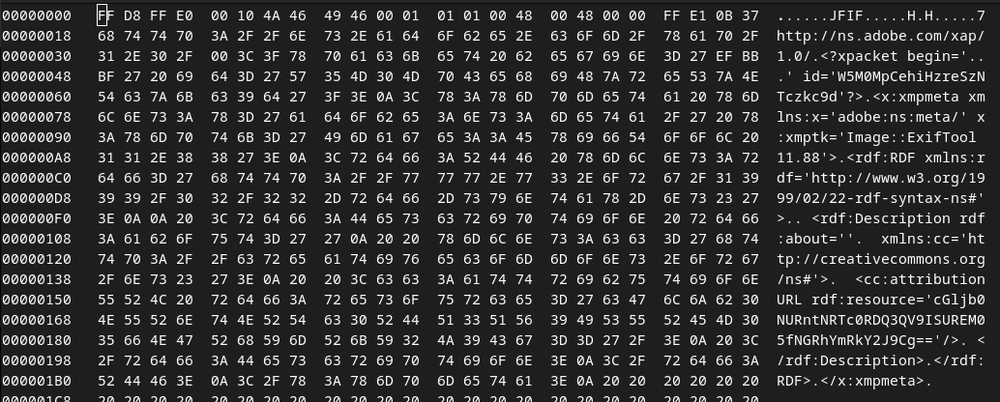

# PicoCTF 2024 Forensics Writeup: CanYouSee

## Downloading the Files
First, we download the required files using `wget`:

```bash
wget https://artifacts.picoctf.net/c_titan/5/unknown.zip
```

## Decompressing the file
We are given a zip file, let's try to unzipping it!

```bash
unzip unknown.zip
```

Well it looks like it extracted a really big image? Let's try opening it using `xdg-open`!

```bash
xdg-open ukn_reality.jpg
```


Okay so it wasn't actually that easy, as it's not actually a `PNG` nor a `BMP`, `zsteg` won't be able to help us here, so let's just look at the binaries 

```bash
binwalk ukn_reality.jpg
```

**Output:**
```
DECIMAL       HEXADECIMAL     DESCRIPTION
--------------------------------------------------------------------------------
0             0x0             JPEG image data, JFIF standard 1.01
1689397       0x19C735        TROC filesystem, 1758023072 file entries
```

It doesn't look like it's helping us with anything! As TROC file systems are usually false positives, So let's put that aside and take a look at the hex contained in the image!

## Diving in
After seeing that `binwalk` is unable to help us in this problem, we can use an hex editor we like! And i prefer to use `hexedit` that's available in any debian distros! So let's open the file!

```bash
hexedit ukn_reality.jpg
```

**Output:**


As there's too many hex that is contained in the file which is `0x228AD2` long! So we will just have to look on the first lines of hex until `000001B0`

## Decoding
After taking a look at the first lines of hex, I came to suspect that the hex at `00000138` is hiding something, here is what we got:

```
<cc:attribution URL rdf:resource='cGljb0NURntNRTc0RDQ3QV9ISUREM05fNGRhYmRkY2J9Cg=='/>
```

Looking at a glance we could see that it's a base64 encoding! Lets decode it using the following command:

```bash
echo cGljb0NURntNRTc0RDQ3QV9ISUREM05fNGRhYmRkY2J9Cg== | base64 -d
```

**Output:**
```
picoCTF{ME74D47A_HIDD3N_4dabddcb}
```

That's it! that's the flag!
