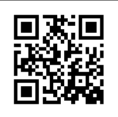

# PicoCTF 2024 Forensics Writeup: Scan Surprise

## Downloading the Files
First, we download the required files using `wget`:

```bash
wget https://artifacts.picoctf.net/c_atlas/15/challenge.zip
```

## Decompressing the file
We are given a zip file, let's try to unzipping it!

```bash
unzip challenge.zip
```

Well it looks like we have a folder named `home`

## Diving in
Let's try to `cd` our way in to the directory! and you can just use the `tab` key to make it faster! Your path to the directory should look something a bit like this:

```bash
cd home/ctf-player/drop-in/
```

Now let's check what file is stored inside this directory using the `ls` command:

```bash
ls
```

**Output:**
```
flag.png
```
Oh we got a flag with the format of a PNG!

## Extracting the file
After we saw that its a PNG let's try opening it!

```bash
xdg-open flag.png
```


It's a barcode! Then let's use zbar-tools to get the data!

```bash
zbarimg flag.png
```
**Output:**
```
zbarimg flag.png 
QR-Code:picoCTF{p33k_@_b00_19eccd10}
scanned 1 barcode symbols from 1 images in 0.01 seconds
```

That's it! that's the flag!
