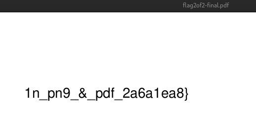
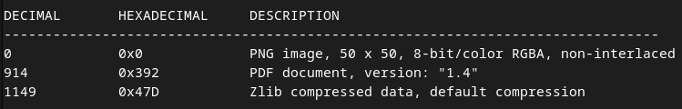
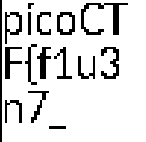

# PicoCTF 2024 Forensics Writeup: Secret of The Polyglot

## Downloading the Files
First, we download the required files using `wget`:

```bash
wget https://artifacts.picoctf.net/c_titan/99/flag2of2-final.pdf
```

## Inspecting the flag2of2-final.pdf
We are given a pdf file, let's try to open it as is!



When we open it as is, which is a pdf file we can find that we were given a string `1n_pn9_&_pdf_2a6a1ea8}` it looks like this string is the second half of our flag! 

## Searching binary images for embedded files and executable code
Let's try looking for any embedded files inside the pdf:

```bash
binwalk flag2of2-final.pdf
```

**Output:**


Upon examining the output, we notice that its magic number hex is a PNG!

## Extracting the file
After we saw that its both a PDF file and a PNG we can just rename the file extension to a `.png`

```bash
cp flag2of2-final.pdf flag2of2-final.png
```

## Retrieving the Flag and Conclusion
Now that we have renamed the file's extension to `.png` we can just open it using

```bash
xdg-open flag2of2-final.png
```


Hey! That's the first half of the flag that we were looking for! Now lets just aggregate the 2 and we have the flag!
